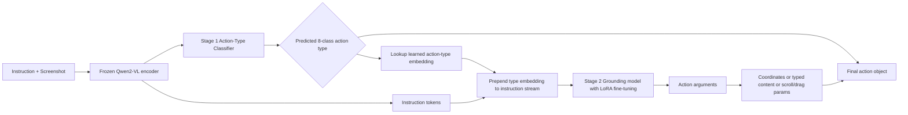
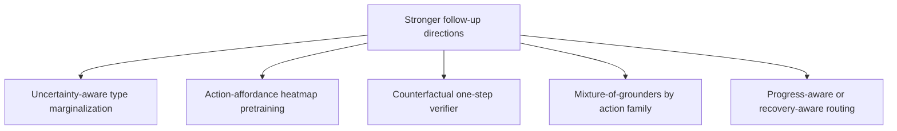

# Action-Type-Conditioned Grounding for GUI Agents

> **Historical literature-review memo.** Written before the final experiments;
> use this for related-work context and paper positioning, not for current
> results or the final project verdict. Current empirical source of truth:
> `../README.md#status`, `../results/phase4/PHASE6_FINAL.md`, and
> `../results/phase4/PHASE7_RESULTS.md`.

## Executive summary

Your project idea is **credible, timely, and probably novel enough for a strong CS231n final project**, but its publishability depends on how far you push it beyond a “clean engineering ablation.” The current GUI-agent literature is crowded around end-to-end vision-language-action modeling, unified action spaces, grounding-specific heads, reinforcement learning, and test-time search; however, I did not find a prior paper that **explicitly separates action-type prediction into its own learned classifier stage and then conditions grounding on that predicted action type via a learned class embedding prepended into the VLM instruction stream** in the exact way you propose. Existing systems typically serialize action type and location or arguments through one generative interface, or they improve grounding with specialized heads, verifiers, RL rewards, or test-time zoom/search rather than a classifier-first, action-conditioned grounding stack. That means the idea is **not “obviously done already,”** but it is also **not radically orthogonal** to recent trends such as GUI-Actor’s dedicated grounding head, UI-R1’s decomposition of action reward into action-type and action-argument components, and modular planner-grounder systems such as SeeAct-V with UGround. citeturn32view0turn32view4turn32view2turn33view0turn24search2turn11view6

The literature strongly supports your motivating failure mode. Mind2Web’s official metrics explicitly separate element accuracy, operation F1, and step success rate, and define a successful step as getting both the selected element and the operation right; that is exactly the structure you want to exploit by disentangling “what action” from “where to act.” SeeClick reported that better GUI grounding correlates with downstream agent gains, while Mind2Web and later Online-Mind2Web argued that current web-agent progress can look overly optimistic offline and remains fragile on realistic, long-horizon tasks. More recent GUI/agent work also shows that action-type and step-level outcomes can diverge: a mobile world-model study notes mismatches between action-type accuracy and step accuracy, with improvements in coordinates sometimes masking persistent type errors. In short, the empirical setup you are targeting maps onto a real, documented bottleneck rather than a contrived modeling preference. citeturn16view0turn16view1turn10view7turn18search0turn26view0

The most important strategic recommendation is this: **frame the project as a study of factorization, calibration, and error propagation**, not just as “add an MLP head.” If you show that a classifier-first design improves action-type macro-F1, per-class grounding accuracy, and downstream step success — especially on classes like scroll, type, drag, or wait where action-type confusion is common — then the project becomes much more than an implementation tweak. The strongest paper version would also include an “oracle action type” upper bound, confidence-aware soft routing, and error analyses showing when hard conditioning helps versus hurts. Without that, reviewers could say the improvement comes from extra supervision or routing, not from the conditioning principle itself. citeturn16view0turn24search2turn33view0turn30search4

## Method landscape and quick comparison

The current design space mixes three partially independent choices: whether a model is **vision-only or vision+metadata**, whether action and grounding are **jointly serialized or modularized**, and whether improvements come from **training-time architecture changes** or **test-time search/refinement**. This matters because your idea sits at the intersection of all three: it keeps a modern VLM backbone, introduces a light modular split, and changes the conditioning pathway during training and inference. The table below is the practical map of the papers you should keep in your head while positioning your work. citeturn11view4turn11view6turn32view0turn32view4turn32view2turn33view0turn30search4

| Method | Architecture sketch | Action/location coupling | Data emphasis | Most relevant reported result | Source |
|---|---|---|---|---|---|
| **SeeClick** | LVLM continually pre-trained for GUI grounding and action generation from screenshots | Mostly joint; a single visual GUI agent predicts low-level actions, though the paper also foregrounds grounding as the bottleneck | Curated web + mobile grounding data; introduces ScreenSpot | Shows grounding improvements correlate with downstream agent gains; establishes ScreenSpot as a realistic benchmark | citeturn11view4turn10view7turn11view4 |
| **UGround / SeeAct-V** | Separate planning MLLM plus visual grounding model that directly outputs coordinates | More modular than end-to-end VLA, but not action-type-classifier-first | 10M GUI elements over 1.3M screenshots | UGround outperforms prior GUI grounding models by up to 20% absolute and helps screenshot-only agents match or beat stronger mixed-input baselines | citeturn9view4turn10view14turn10view16 |
| **OS-Atlas** | Foundation action model with unified action space and large cross-platform synthesized grounding data | Joint action model in a unified action space; no dedicated type-then-ground pipeline | 13M cross-platform GUI grounding instances | 85.14 average ScreenSpot grounding accuracy for OS-Atlas-Base-7B in the reported setup | citeturn10view0turn32view4turn11view1 |
| **ShowUI** | Qwen2-VL-based VLA with UI-guided token selection and interleaved vision-language-action streaming | Joint serialization in JSON with action type, value, and position | 256K curated GUI instruction-following data | Best reported Mind2Web Step SR in the table shown is 35.2, with strong online MiniWob performance | citeturn9view2turn32view2turn11view5 |
| **UI-TARS** | Screenshot-only native GUI agent with unified action modeling and explicit “system-2” thought augmentation | Joint action generation from a predefined unified action space | Large internal + open-source trace and grounding data | Reported as SOTA across many GUI-agent benchmarks; GUI-Actor cites UI-TARS-72B at 38.1 on ScreenSpot-Pro | citeturn10view11turn32view0turn37view0turn33view0 |
| **GUI-Actor** | Frozen or lightly tuned VLM plus dedicated attention-based action head and verifier | Decouples grounding from coordinate token generation, but not action-type classification | GUI grounding data with patch-level supervision | 44.6 on ScreenSpot-Pro with Qwen2.5-VL-7B backbone; 40.7 with Qwen2-VL-7B backbone | citeturn33view0 |
| **UI-R1** | RL fine-tuning with rule-based reward on low-level GUI action prediction | Still joint generation, but reward explicitly separates action type and action argument | Small, high-quality mobile instruction set | Reports +15 points in action-type accuracy and +10.3 in grounding accuracy over the base model on AndroidControl | citeturn24search2turn33view1 |
| **RegionFocus** | Training-free visual test-time scaling with iterative zoom and image-as-map landmarks | Leaves base model joint, but refines grounding through search | Benchmark-time only | Raises ScreenSpot-Pro by 28+ points on top of strong open VLM agents and reaches 61.6 with Qwen2.5-VL-72B | citeturn30search4 |

Your proposed two-stage pipeline is easiest to justify if you present it as a **middle point between end-to-end joint VLA models and pure grounding-only specialists**: more structured than UI-TARS/ShowUI/OS-Atlas, less task-fragmented than planner+external-grounder systems, and more semantically targeted than training-free zoom methods. The closest architectural analog in spirit is probably **GUI-Actor**, because it introduces a dedicated grounding head to escape coordinate-token bottlenecks; the closest training analog is **UI-R1**, because it already treats action type and action argument as separable optimization targets. What is missing in the literature, and where your project sits, is the explicit claim that **the right semantic conditioning variable for grounding is not just the instruction, but the predicted action type itself**. That is a defensible claim if the ablations are convincing. citeturn33view0turn24search2turn32view2turn32view4turn32view0

## Tiered reading list

### Core and prioritized

**UI-TARS: Pioneering Automated GUI Interaction with Native Agents** citeturn9view0turn10view11turn32view0turn37view0  
UI-TARS is the clearest recent exemplar of the “native agent” philosophy: screenshot-only perception, a unified action space across platforms, and deliberate reasoning traces inserted before actions. The key technical move is not just scale, but the combination of unified action modeling and thought augmentation, which turns demonstration traces into richer action-plus-reasoning trajectories. Its strength is scope: it touches grounding, offline agent evaluation, and online benchmarks, so it is the most important paper to read if you want to understand what strong modern end-to-end GUI agents look like. Its weakness, for your purposes, is also its opportunity: although UI-TARS standardizes actions, it still treats final action prediction as one model-level interface rather than learning a separate classifier that conditions a second grounding stage. You should cite it as a primary baseline family and as evidence that the default top-line design in the field is still joint or at least unified at the output interface.

**OS-Atlas: A Foundation Action Model for Generalist GUI Agents** citeturn9view1turn10view0turn32view4turn11view1  
OS-Atlas is the most important “open data infrastructure meets strong action model” paper in this space. Its signature contribution is a cross-platform data synthesis platform and a unified action space that reduces naming conflicts such as click versus tap and collapses heterogeneous action vocabularies into a consistent schema. The strength of the paper is that it makes the action-space unification problem explicit and backs that up with large-scale synthetic data; it is also one of the strongest sources to cite when you discuss why action-label harmonization matters before any modeling begins. The weakness is that its main architectural answer remains a strong unified action model, not a conditional factorization between action type and grounding. You should borrow its lesson on canonicalizing action taxonomies, and you should explicitly explain that your project asks a different question: after unification, should action type still be predicted jointly with location?

**SeeClick: Harnessing GUI Grounding for Advanced Visual GUI Agents** citeturn9view3turn11view4turn10view6turn10view7turn32view6  
SeeClick is foundational because it makes GUI grounding the centerpiece of visual GUI agents instead of treating it as a side effect of language generation. The core idea is continual grounding pre-training on curated web and mobile GUI data, plus the release of ScreenSpot as a realistic grounding benchmark. Its great strength is the paper’s causal narrative: better grounding directly improves downstream agent behavior, which is exactly the logic your project needs. The weakness is that the action space is still relatively limited compared with the richer desktop/mobile settings now common, and the model is not built around explicit modular action-type decisions. You should cite it both as a primary related-work anchor and as one of the main empirical motivations for isolating and improving grounding-related bottlenecks.

**ShowUI: One Vision-Language-Action Model for GUI Visual Agent** citeturn9view2turn10view9turn11view5turn32view2turn32view3  
ShowUI is the clearest paper showing how the current field operationalizes GUI acting as structured sequence generation from a VLM. The technical idea you should pay attention to is the model’s interleaved vision-language-action streaming and its explicit JSON-style action schema, which packs action type, value, and position into one generative object. Its strengths are efficiency and realism: it builds a compact VLA around Qwen2-VL-style ingredients and demonstrates competitive Mind2Web and MiniWob results with a relatively small model and curated data. The weakness for your project is that it exemplifies the exact coupling you want to challenge — action type and position are serialized together, which can encourage coherent but wrong commitments. You should read ShowUI carefully because it is the most direct baseline to reproduce conceptually when you compare “flat joint decoding” against your classifier-conditioned grounding variant.

**Navigating the Digital World as Humans Do: Universal Visual Grounding for GUI Agents** citeturn9view4turn10view14turn10view16turn10view17  
This paper introduces UGround and is the best argument for studying grounding as a distinct skill that can be trained at scale outside the full agent loop. The central idea is simple but powerful: build a massive visual grounding dataset over GUI screenshots and use a dedicated grounding model to map referring expressions to pixel-level targets, then plug that model into a screenshot-only agent. Its strength is conceptual clarity — the planning module and the grounding module are actually separable, and the paper makes the benefits of that modularization concrete across several benchmarks. Its weakness relative to your project is that the module boundary is between *plan text* and *grounding*, not between *action type* and *grounding*, so it still leaves unexplored whether the action type itself is the right latent variable for conditioning spatial attention. You should borrow the modular evaluation mindset and especially the idea of testing oracle components separately before claiming full-agent gains.

**GUI-Actor: Coordinate-Free Visual Grounding for GUI Agents** citeturn33view0  
GUI-Actor is probably the single most important recent paper to read if you want your project to feel current rather than merely reactive to 2024 models. It argues that coordinate-token regression is a poor fit for GUI grounding and replaces it with an attention-based action head driven by a dedicated `<ACTOR>` token, plus a verifier that chooses among proposed action regions. The strengths are strong empirical results, much better parameter efficiency, and a clean argument about why patch-aligned region prediction can be superior to coordinate generation. The weakness, from your project’s viewpoint, is that it improves *how* grounding is represented without addressing *which action type* should govern the grounding process. You should cite GUI-Actor as the closest architectural neighbor and as the strongest evidence that “adding a dedicated head” can matter, but you should also explain that your contribution targets semantic routing rather than coordinate representation alone.

### Important background

**Mind2Web: Towards a Generalist Agent for the Web** citeturn13view0turn16view0turn16view1  
Mind2Web is the canonical benchmark paper for your project because it formalizes web-agent evaluation around real websites, open-ended tasks, and step-level action supervision. The paper’s most important contribution for you is not just the dataset scale, but the official metric decomposition into element accuracy, operation F1, step success rate, and task success rate. Its strength is realism: unseen websites and domains make it much harder to coast on memorized interaction templates. Its weakness is that the original paper is HTML-centric through MindAct, so it does not itself resolve the screenshot-grounding issues that later GUI-agent work confronts. You should use Mind2Web both as a benchmark and as the conceptual reason your project should evaluate action type and grounding separately at the step level.

**GPT-4V Is a Generalist Web Agent, If Grounded** citeturn9view11  
This is the SeeAct paper and one of the best “why grounding matters more than planning” papers in the literature. The key idea is that a strong multimodal model can often produce a sensible textual plan, but grounding that plan into the right element and operation remains the brittle part; the paper explores several grounding strategies and shows a large gap between current methods and oracle grounding. Its strength is diagnostic value: it separates high-level competence from low-level actionability, which is exactly the separation you need to motivate a classifier-first design. Its weakness is that the grounding interface still depends on auxiliary candidates such as HTML or Set-of-Mark labels, so it is not yet the purely visual, action-conditioned story you want. You should cite it as perhaps the most direct ancestor of your motivation section, especially when arguing that coherent plan generation is not the same as correct actuation.

**WebVoyager: Building an End-to-End Web Agent with Large Multimodal Models** citeturn9view12  
WebVoyager moves from offline action prediction to live end-to-end web interaction and adds a practical automatic evaluation protocol. The primary contribution is not a novel factorization but a realistic benchmark and system recipe for multimodal web agents operating across real websites. The paper’s strength is that it forces you to think about complete trajectories rather than only one-step predictions; this is important because your proposed decoupling only matters if it improves long-horizon success rather than just isolated click localization. The weakness is that its evaluation and architecture are broad rather than mechanistic, so it is not the place to find the most precise insights about action-type/location coupling. You should read it to calibrate what “system success” means and to avoid overclaiming from single-step gains.

**Visual Grounding for User Interfaces** citeturn35view0  
This paper is a useful pre-GUI-agent bridge between classical UI element detection and modern free-form language grounding. Its core contribution is LVG, which unifies UI element detection and language grounding via layout-guided contrastive learning and synthetic-data augmentation. The strength of the paper is that it explicitly argues that raw UI detection alone is too semantically thin, while metadata-only approaches are incomplete; that is a very clean framing for why GUI grounding deserves its own modeling machinery. The weakness is historical: it predates the strongest end-to-end VLM GUI agents, so its architecture is less directly reusable than newer Qwen2-VL-based methods. You should cite it when grounding your project in the broader UI-understanding literature rather than only in the newest agent papers.

### Related multimodal and LLM foundations

**Qwen2-VL: Enhancing Vision-Language Model’s Perception of the World at Any Resolution** citeturn9view5  
Qwen2-VL is your backbone paper, so you need to know it beyond the abstract. The key technical ideas are Naive Dynamic Resolution and M-RoPE, which make the model substantially better at variable-resolution visual inputs and spatially grounded reasoning — exactly the kind of behavior high-resolution GUI screenshots require. Its strengths are broad multimodal competence and excellent spatial handling, which make it a sensible base for both the action-type classifier and the conditioned grounding stage. Its weakness is also what creates your project: it is a strong general VLM, not a GUI-native modular controller, so left alone it will adopt the usual joint generation bias from its fine-tuning objective. You should borrow it as the base model, cite it to justify the backbone choice, and keep your training changes light enough that improvements can be attributed to your factorization rather than to brute-force full-model adaptation.

**ReAct: Synergizing Reasoning and Acting in Language Models** citeturn28search6turn21search13  
ReAct is not a GUI paper, but it remains essential for understanding how the field thinks about interleaving cognition and action. The paper’s core insight is that reasoning traces and acting traces can help each other: reasoning maintains task progress and error handling, while acting grounds the model in external state. Its strength is conceptual durability — many GUI-agent “thought” or reflection methods are downstream variants of this framing. The weakness for your exact project is that ReAct does not tell you how to decompose action *semantics* from action *parameters* within one interface step. You should cite it when discussing why adding an explicit action-type classifier is not anti-reasoning; rather, it is one more structured intermediate variable in an already modular trend toward interpretable action selection.

**RT-2: Vision-Language-Action Models Transfer Web Knowledge to Robotic Control** citeturn34view1turn34view2  
RT-2 matters because it is the paper that normalized the idea of representing actions as tokens within a vision-language model. The key technical move is to cast robotic actions into the same textual interface as language outputs, letting a pretrained VLM become a VLA model through co-fine-tuning. The paper’s strength is that it demonstrates the power of unified token-level action generation; it is the cleanest articulation of the paradigm your project is partly pushing against. Its weakness, in GUI settings, is that token unification can hide structure that may be useful for control, especially when action type and arguments are tightly coupled but not identical in difficulty. You should cite RT-2 to show that your proposal is not anti-VLA per se; it is a targeted critique of when fully unified tokenization becomes a liability.

**Do As I Can, Not As I Say: Grounding Language in Robotic Affordances** citeturn33view9  
SayCan is highly relevant because it explicitly separates “useful according to language” from “feasible according to the environment.” The main idea is to combine an LLM’s prior over plausible next skills with affordance/value estimates that say whether those skills are executable in the current state. Its strength is that it provides a direct conceptual analog to what you want to do in GUI control: action type is the “useful” semantic variable, while grounding is the “feasible here” variable. Its weakness is domain transfer — the paper is about robotics skills rather than pixel-precise GUI control. You should use it as a conceptual citation for modular action selection and as evidence that decoupling semantics from execution is a well-motivated design pattern in embodied decision-making.

### Optimization, conditioning, and decoding

**UI-R1: Enhancing Action Prediction of GUI Agents by Reinforcement Learning** citeturn24search2turn33view1turn24search0  
UI-R1 is probably your most important “this is close, but not the same” paper. It uses rule-based RL for low-level GUI action prediction and explicitly decomposes the reward into action-type reward, action-argument reward, and formatting reward, which is strong evidence that the field already views type and argument as separable optimization targets. Its strength is that it reports large gains from this decomposition even with a small, curated training set, which supports your hypothesis that better action-type handling can help downstream control. Its weakness is that the decomposition happens in the *reward*, not in the *architecture*; the model still produces a joint output rather than first predicting type and then conditioning grounding. You should cite UI-R1 heavily in the novelty discussion because it narrows the novelty gap but also helps you sharpen it.

**Set-of-Mark Prompting Unleashes Extraordinary Visual Grounding in GPT-4V** citeturn34view0turn34view3turn34view4  
Set-of-Mark is a prompting paper, but it matters because it reveals just how much grounding performance can improve when you introduce a more explicit interface between semantics and regions. The technical idea is to segment an image into meaningful regions and overlay readable marks so the model can reason over discrete candidates instead of raw pixels alone. Its strength is that it shows interface design can unlock latent grounding ability without retraining the base model. Its weakness for your use case is that SoM is still candidate-based and often depends on a preprocessing stack; it is not the right final architecture for fluid GUI agents. You should cite it as evidence that **conditioning and representation choices at the grounding interface matter enormously**, which strengthens the plausibility of action-type-conditioned grounding.

**Language-Conditioned Detection Transformer** citeturn36view2turn36view3  
DECOLA is not a GUI paper, but it is one of the cleanest primary-source examples of conditioning the detector itself on a queried concept set. The technical idea is to train a detector whose inner prediction mechanism is conditioned on the language describing what categories are present, yielding better pseudo-labels and strong open-vocabulary transfer. Its strength is direct relevance to your conditioning story: it gives you a principled analogy for why prepending or injecting an action-type embedding could reshape what the model treats as foreground during grounding. Its weakness is that DETR-style object detection is still cleaner than GUI interaction, where the same region can be relevant under multiple action types. You should cite DECOLA not as related work in GUI agents, but as methodological support for class- or concept-conditioned localization.

**Visual Test-time Scaling for GUI Agent Grounding** citeturn30search4  
RegionFocus is worth reading because it demonstrates that substantial grounding gains can come purely from iterative visual search at inference time. The core idea is to dynamically zoom into focal regions and encode landmarks back into the image so the model can continue grounding with a more constrained visual field. Its strength is practical seriousness: the paper reports very large improvements on ScreenSpot-Pro and strong gains on WebVoyager without changing the underlying base model’s training objective. The weakness, for your project, is that this can become a very strong baseline or competing explanation — if your gains are modest, someone may say test-time search already solves the problem more simply. You should read it so you can either compare against it directly or clearly explain why you are improving internal decision factorization rather than merely adding more inference compute.

### Datasets and benchmarks

**Android in the Wild: A Large-Scale Dataset for Android Device Control** citeturn12view0turn12view1turn12view2  
AITW is the main large-scale mobile-control dataset you should treat as supervision infrastructure rather than just a benchmark. It contains 715K episodes, 30K unique instructions, and a gesture-rich action space that includes precise interactions rather than only simple element labels. Its strength is diversity across Android versions, devices, and interaction types, which makes it valuable for learning action-type priors and for exposing the model to type/scroll distinctions that web-only data underrepresents. Its weakness is domain mismatch: the semantics of web interfaces and mobile app interfaces are related but not identical, and naive mixing can create label conflicts or spurious correlations. You should use it, but only after carefully defining a canonical action taxonomy and being explicit about what scroll, type, drag, and finish mean across domains.

**On the Effects of Data Scale on UI Control Agents** citeturn12view3turn12view4turn12view5turn12view6  
This paper introduces AndroidControl and is especially valuable because it asks whether data scale alone can solve UI agent generalization. The key contribution is the AndroidControl dataset — 15,283 demonstrations covering 14,548 unique tasks over 833 Android apps, with both high-level and low-level instructions — plus a scaling analysis showing that in-domain gains do not translate cleanly out of domain. Its strength is that it directly warns against a lazy interpretation of more-data-is-enough, which is highly relevant to your project. Its weakness is that the paper is more about scaling behavior than architecture. You should cite it whenever you argue that structural decoupling might improve generalization in ways that additional demonstrations alone cannot.

**ScreenSpot-Pro: GUI Grounding for Professional High-Resolution Computer Use** citeturn11view7turn30search6  
ScreenSpot-Pro is the grounding benchmark you should read when thinking about failure analysis and paper positioning, even if it is not in your main evaluation plan. The dataset consists of 1,581 instructions over unique high-resolution screenshots from 23 applications across five industries and three operating systems, and the paper explicitly shows that many existing GUI grounding models perform badly there. Its strength is realism in professional, cluttered, small-target environments — the exact context where action-type mistakes can be amplified by visually dense layouts. Its weakness is that it is a grounding benchmark, not a full long-horizon task suite, so it will not on its own tell you whether better action typing improves trajectory success. You should use it as a stress-test benchmark or at minimum as a citation for why grounding still bottlenecks serious computer-use agents.

**The Showdown Computer Control Evaluation Suite and showdown-clicks** citeturn9view10turn3search0  
Showdown is not a conventional paper, but you should still treat it as required reading because it is becoming a de facto evaluation artifact for desktop click grounding. The showdown-clicks dataset contains 5,679 human left-clicks collected in a macOS desktop environment and is intended to isolate instruction-following and low-level control. Its strength is focus: because it reduces the task to “where should I click,” it is a very clean place to test whether your action-conditioned grounding stage truly sharpens click localization. Its weakness is also obvious: it isolates clicks and therefore does not exercise your full 8-class action taxonomy, so you should not treat good Showdown performance as proof that the whole method works. You should use it exactly as you proposed — as a targeted click-grounding benchmark — and clearly say that it only covers one action family.

### Peripheral and adjacent

**OmniParser for Pure Vision Based GUI Agent** citeturn36view0turn36view1  
OmniParser is a strong adjacent paper because it improves GUI agents by inserting a dedicated screen parsing module before the decision model. The main idea is to convert screenshots into structured elements using icon detection and captioning, thereby giving GPT-4V and related models a better pre-digested interface to act on. Its strength is that it shows modular preprocessing can dramatically improve screenshot-only systems, which is useful if you later want to enrich conditioning with detected affordance classes or parsed element semantics. Its weakness is that it still depends on an external parse-then-act pipeline rather than solving the factorization *inside* the action model. You should read it mainly to avoid rediscovering preprocessing tricks and to understand what gains might come from better UI structure rather than from your classifier-first idea.

**Scaling Computer-Use Grounding via User Interface Decomposition and Synthesis** citeturn31search0turn31search3turn31search15  
This paper introduces OSWorld-G and the large synthesized Jedi dataset, arguing that existing grounding benchmarks are too simplistic and that training data should be decomposed into richer subskills such as text matching, layout understanding, and manipulation. The strength of the paper is that it directly treats grounding as a multi-faceted capability rather than a single click-point problem, which aligns well with your action-type taxonomy story. Its weakness is that the decomposition is mostly along *task content* and *UI element types*, not along *action type first, grounding second*. You should cite it if you later argue that your action-conditioned mechanism is especially helpful on subset categories like precise manipulation or layout-sensitive scrolling. It is also a great source of ideas for future benchmark extensions beyond Mind2Web and Showdown.

## Datasets, benchmarks, and metrics that matter for your experiments

The most important evaluation design choice is to **separate diagnostic metrics from final trajectory metrics**. Mind2Web already gives you the right decomposition: element accuracy says whether the target element was grounded correctly, operation F1 says whether the operation and value were predicted correctly, and step success says whether both are right at once. That makes Mind2Web unusually well suited to your project, because you can report improvements in action-type prediction and show whether they convert into the metric that actually matters for step execution. citeturn16view0turn16view1

| Dataset / benchmark | Scale and scope | Most useful metric(s) for your paper | Why it matters here | Source |
|---|---|---|---|---|
| **Mind2Web** | 2,350 tasks from 137 websites across 31 domains | Element Accuracy, Operation F1, Step Success Rate, Task Success Rate | Best fit for showing whether action-type gains transfer into step-level correctness | citeturn14search2turn16view0 |
| **Android in the Wild** | 715K episodes, 30K instructions, gesture-rich mobile control | Per-step action accuracy, per-class type accuracy, OOD splits | Best large-scale source of non-click action supervision | citeturn12view0 |
| **AndroidControl** | 15,283 demonstrations, 14,548 unique tasks, 833 Android apps | Step accuracy, in-domain vs OOD breakdown | Important because the paper shows more data alone is insufficient OOD | citeturn12view3turn12view4 |
| **WaveUI-25K** | 25K labeled UI elements, subset of ~80K preprocessed examples | Top-1 grounding / localization | Good supplementary grounding-only data, but not a peer-reviewed benchmark paper | citeturn27search1 |
| **ScreenSpot-Pro** | 1,581 instructions on high-resolution professional screenshots | Grounding accuracy | Excellent stress test for dense layouts and small targets | citeturn11view7turn30search6 |
| **Showdown Clicks** | 5,679 human left-clicks on macOS desktop | Top-1 click accuracy | Ideal for a narrow test of whether action-conditioned click grounding helps | citeturn3search0turn9view10 |
| **AndroidWorld** | 116 programmatic tasks across 20 real apps | Success Rate | Useful for long-horizon, execution-based follow-up if you extend beyond the class project | citeturn8search3turn8search19 |
| **OSWorld** | 369 real computer tasks across operating systems | Execution-based success / step budgets | Good external benchmark for compounding-error claims | citeturn17search6turn37view2 |

For a strong project paper, I would report at least four additional diagnostics beyond the standard benchmark metrics. First, report **action-type macro-F1** and **per-class confusion matrices** over your 8-class taxonomy. Second, report **grounding accuracy conditioned on the gold action type** and **grounding accuracy conditioned on the predicted action type**; the gap between those two is one of the clearest measures of whether classifier errors or grounding errors dominate. Third, report **first-error position** or an equivalent trajectory-break metric on long-horizon tasks, because a one-step improvement that occurs after the first fatal mistake does not really help users. Fourth, report **calibration** for the action-type classifier, because hard routing with a miscalibrated classifier can be worse than a joint model. The need for careful long-horizon evaluation is strongly reinforced by work such as Online-Mind2Web, which argues that current offline benchmarks can overstate agent competence on realistic web tasks. citeturn16view0turn18search0turn26view0

## Novelty assessment and publishability

My bottom-line assessment is that the idea is **novel enough for a class project and plausibly publishable at a workshop, student workshop, or lower-risk venue if the experiments are strong**, but **probably too incremental for a top-tier full paper unless you deepen the contribution**. The reason it still looks publishable is that recent GUI-agent work has attacked related problems through unified action spaces, specialized grounding heads, RL rewards, verifier modules, modular planner-grounder splits, and test-time zoom/search — yet not, as far as I found, through your exact factorization of **classifier-first action-type prediction followed by learned action-type-conditioned grounding inside the VLM input stream**. The reason it may be judged incremental is that your method is still close in spirit to those recent papers; a reviewer could say it is a reasonable modularization of an already-obvious decomposition rather than a new scientific principle. The difference between “incremental” and “publishable” here will be the strength of your **causal evidence** that entangled decoding specifically causes the observed failures, and that your conditioning method addresses that failure better than simpler alternatives. citeturn24search2turn33view0turn30search4turn31search0turn18search0

The strongest baselines to beat are not just old models from the literature, but **carefully matched versions of your own base model**. At minimum, you should compare against a flat joint Qwen2-VL-7B LoRA baseline, a joint baseline with an auxiliary action-type loss but no conditioning, a hard constrained-decoding or hard-routing baseline, and a “gold action type” oracle-conditioned upper bound. If you can afford it, add a GUI-Actor-style specialized grounding head or at least compare against a verifier-style or test-time scaling baseline such as RegionFocus to show that your gains are not trivially recoverable through extra inference-time search. If your classifier is uncertain, I would also test a soft variant that conditions grounding on the top-k action-type distribution rather than only the argmax class; this is an inference from the literature rather than a reported result, but it is motivated by how hard routing can amplify early mistakes in sequential decision systems. citeturn33view0turn24search2turn30search4turn18search0

A strong experimental bar, in my view, would be something like this. On Mind2Web, you want a **consistent gain across Cross-Task, Cross-Website, and Cross-Domain**, with roughly **2–3+ absolute Step SR** improvement and **3–5+ macro-F1** action-type gain; because Step SR is stringent, even modest but consistent gains there matter. On Showdown Clicks, the meaningful threshold depends on whether you use the public dev subset or the full 5,679-click release; as an inference from those sample sizes, I would treat **<3 points on a small public subset as weak evidence**, but **~2 points on the full dataset** as potentially real if paired tests or bootstrap intervals support it. In all cases, use paired bootstrap or permutation tests at the task or episode level and report 95% confidence intervals. These thresholds are my recommendation, not something stated by the benchmark authors, but they are grounded in the benchmark sizes and in how sensitive step-level metrics are to compounded errors. citeturn16view0turn3search0turn14search2

The most likely failure modes are easy to predict. **Hard routing may become brittle** when the classifier is slightly wrong, especially for classes that are semantically adjacent such as click versus double-click, click versus type near text boxes, or wait versus finished on intermediate states. **Dataset unification may leak label noise** because web, Android, and desktop traces do not parameterize scroll, drag, hotkey, or “finished” in the same way; OS-Atlas and UI-TARS both emphasize how harmful action-space conflicts can be if you mix datasets naively. And even if action-type accuracy improves, the final step metric may not improve proportionally, since recent work on mobile world-model guidance shows that type-level and step-level scores can diverge and that fixes in coordinates can mask deeper semantic problems. Those failure modes do not invalidate the project, but they do mean your paper should carefully isolate when the method helps and when it overcommits. citeturn32view4turn32view0turn26view0

## Alternative directions that are more clearly novel

If you decide the current idea feels too incremental, the best move is not to abandon the factorization intuition but to make it more **probabilistic, structured, or forward-looking**. The following directions are all more distinctive than simple hard classifier-then-ground routing.

### Uncertainty-aware action-type marginalization

Instead of conditioning grounding on a single predicted type, predict a calibrated distribution over the 8 action types and let the grounding stage either marginalize over the top-k types or generate candidate groundings for multiple likely types before re-ranking them. This is more novel because it turns the action-type classifier from a brittle gate into a controllable probabilistic latent variable. The natural experiment is to compare hard argmax routing, top-k marginalization, and oracle-type conditioning on Mind2Web and Showdown Clicks, with a special focus on ambiguous instructions and near-miss examples. You should also report expected calibration error and whether soft routing reduces error cascades. The motivation is consistent with existing evidence that type-level and step-level improvements do not always move together. citeturn26view0turn16view0

### Action-affordance heatmap pretraining

Train action-specific affordance maps — clickable, typable, scrollable, draggable, dismissable, terminal — before or alongside the grounding stage, and then use those maps as intermediate supervision or as additional conditioning features. This is more novel because it moves from discrete class conditioning to **structured action affordance fields**, which may align better with GUI geometry than a single class embedding. A concrete experiment would use OS-Atlas-style unified labels plus AITW and AndroidControl traces to learn affordance heatmaps, then test whether those heatmaps improve per-class grounding and reduce confusion between UI elements that are visually similar but afford different actions. This direction also pairs naturally with GUI-Actor-style patch-level heads. It is adjacent to, but distinct from, parser-driven pipelines such as OmniParser. citeturn32view4turn12view0turn12view3turn33view0turn36view0

### Counterfactual one-step action verification

Generate several candidate action-type-plus-argument hypotheses, predict the likely next state for each one, and use a verifier or world-model judge to re-rank them before execution. This is more novel because it adds an explicit counterfactual selection stage that reasons about **what would happen if I clicked here versus scrolled here versus typed here**, rather than only estimating the immediate action distribution. The most straightforward datasets are AndroidControl and AITW for learning one-step transitions, with evaluation on AndroidWorld or Online-Mind2Web for long-horizon gains. This direction aligns with recent world-model work in GUI agents, but your angle would be to make the counterfactual branch specific to resolving action-type ambiguity rather than only general search. The risk is simulator or renderer hallucination, so you would need strong ablations. citeturn26view0turn18search0turn8search19

### Mixture-of-grounders with semantic experts

Replace one shared grounding module with several lightweight action-family-specific experts: one for click-like pointing, one for text entry, one for scroll containers, one for drag targets, and one for terminal-state decisions. This is more novel than simple conditioning because it turns the semantic split into an actual expert architecture and lets you ask whether some action classes genuinely deserve different spatial representations. A clean experiment would compare shared grounding, class-embedding conditioning, hard expert routing, and soft mixture routing under the same Qwen2-VL backbone and LoRA budget. If the experts are small, you could even test whether the main gains come from representational specialization rather than from extra parameter count. This idea is closest in spirit to GUI-Actor’s dedicated action head, but goes further by specializing the grounding mechanism itself by action family. citeturn33view0turn24search2

### Progress-aware or recovery-aware routing

Instead of predicting only the next action type, predict whether the current step should be *advancing*, *recovering*, *waiting*, or *terminating*, then condition action-type and grounding on that higher-level progress state. This is more distinctive because it moves beyond single-step semantics into temporal control structure, which is where many long-horizon GUI agents fail. The natural datasets are Mind2Web, Online-Mind2Web, OSWorld, and AndroidWorld, where first-error position and recovery behavior really matter. A good test would compare standard action-type conditioning against progress-aware conditioning on trajectories that require undoing mistakes or pausing for state changes. This direction is especially promising if you want a cleaner story about compounding errors rather than just better click selection. citeturn18search0turn17search6turn8search19

## Ordered reading schedule

The right reading order is not chronological. You should first build a **current-method picture**, then a **benchmark picture**, then a **theory-for-your-contribution picture**.

| Order | Read this first | Estimated time | Why it comes here |
|---|---|---:|---|
| 1 | **Mind2Web** | 60–75 min | Defines the most important benchmark and official metrics you will almost certainly report | 
| 2 | **SeeClick** | 50–65 min | Best early grounding-centric GUI-agent paper; motivates the whole problem |
| 3 | **ShowUI** | 50–65 min | Best direct “joint serialized action object” baseline to compare your idea against |
| 4 | **OS-Atlas** | 60–75 min | Teaches action-space unification and cross-platform data synthesis |
| 5 | **UI-TARS** | 75–90 min | Most important modern native-agent paper and strongest general baseline family |
| 6 | **UGround / SeeAct-V** | 60–75 min | Shows what modular planning-plus-grounding looks like today |
| 7 | **GUI-Actor** | 50–65 min | Closest recent architectural neighbor to your project |
| 8 | **Qwen2-VL** | 45–60 min | Backbone understanding before implementation details |
| 9 | **UI-R1** | 40–55 min | Closest novelty-adjacent paper because it separates type and argument in the reward |
| 10 | **ScreenSpot-Pro** | 35–50 min | Gives you a modern grounding stress test and many failure cases |
| 11 | **Android in the Wild** | 35–50 min | Understands mobile action diversity and gesture-rich supervision |
| 12 | **AndroidControl** | 35–50 min | Critical for generalization and dataset-scale caveats |
| 13 | **SeeAct** | 40–55 min | Clean grounding bottleneck story and early modular web-agent framing |
| 14 | **WebVoyager** | 40–55 min | End-to-end evaluation perspective so you do not overfocus on one-step metrics |
| 15 | **Visual Grounding for User Interfaces** | 30–45 min | Good historical bridge from UI understanding to GUI grounding |
| 16 | **Set-of-Mark** | 25–40 min | Sharpens your intuition for interface-level conditioning |
| 17 | **DECOLA** | 30–45 min | Conditioning analogy for label-aware localization |
| 18 | **RegionFocus** | 30–45 min | Strong inference-time baseline family you may need to acknowledge |
| 19 | **RT-2** | 35–50 min | Read if you want stronger VLA framing in your related-work section |
| 20 | **SayCan** | 25–40 min | Read if you want a strong modular-action-selection concept citation |
| 21 | **OmniParser** | 25–40 min | Read if you consider adding parsing or affordance preprocessing |
| 22 | **OSWorld-G / Jedi** | 30–45 min | Read if you want future extensions or richer grounding categories |
| 23 | **Showdown Clicks artifact** | 20–30 min | Only needs a careful benchmark read, not a full paper dive |

If you have only one week, read items 1–10 thoroughly and skim the rest. If you have two weeks, read 1–16 thoroughly and turn 17–23 into targeted lookups while writing the proposal and experiment plan. The most efficient workflow is to annotate every paper in four columns: **problem**, **representation of action**, **representation of grounding**, and **how evaluation separates or entangles them**. That annotation scheme will make your related-work section almost write itself. citeturn16view0turn10view7turn32view2turn32view4turn32view0turn33view0

## Open questions and limitations

A few details in your current project framing are still underspecified and will matter a lot experimentally. The biggest one is the **canonicalization of non-point actions** across datasets: click is easy, but drag, scroll, hotkey, wait, and finished are represented differently across Mind2Web, AITW, AndroidControl, and desktop benchmarks, and prior work has repeatedly warned that unifying conflicting action spaces is nontrivial. The second is whether you will evaluate Showdown on the public subset or the fuller release/leaderboard protocol; the meaning of small absolute gains depends heavily on that choice because the public dev set is much smaller than the full 5,679-click release. The third is that **WaveUI-25K appears to be a dataset artifact/card rather than a peer-reviewed paper**, so it is fine to use, but you should describe it transparently as supplemental training data rather than an established academic benchmark. Finally, the prompt’s step count estimates for AndroidControl differ from the official paper’s demonstration/task counts; if you convert demonstrations to step-level supervision, document exactly how many training steps you obtain after preprocessing. citeturn32view4turn32view0turn3search0turn27search1turn12view3

If you address those design details cleanly, your current idea is worth doing. My honest assessment is: **yes, it is novel enough to pursue; yes, it is publishable in the right format if the empirical story is strong; and no, it is not yet distinctive enough to rely on the architectural idea alone without very careful ablations, calibration analysis, and error-propagation evidence.** citeturn24search2turn33view0turn18search0
